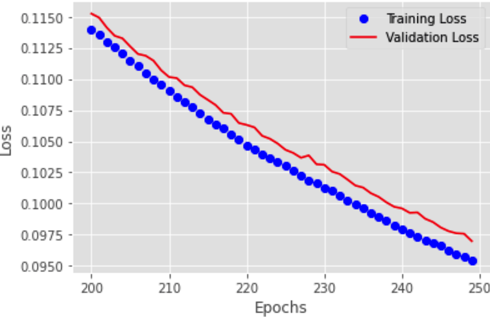

# Fractal Autoencoders for Feature Selection (AAAI 2021)

Paper link: https://ojs.aaai.org/index.php/AAAI/article/view/17242

---

> Feature selection reduces the dimensionality of data by identifying a subset of the most informative features. In this paper, we propose an innovative framework for unsupervised feature selection, called fractal autoencoders (FAE). It trains a neural network to pinpoint informative features for global exploring of representability and for local excavating of diversity. Architecturally, FAE extends autoencoders by adding a one-to-one scoring layer and a small sub-neural network for feature selection in an unsupervised fashion. With such a concise architecture, FAE achieves state-of-the-art performances; extensive experimental results on fourteen datasets, including very high-dimensional data, have demonstrated the superiority of FAE over existing contemporary methods for unsupervised feature selection. In particular, FAE exhibits substantial advantages on gene expression data exploration, reducing measurement cost by about 15% over the widely used L1000 landmark genes. Further, we show that the FAE framework is easily extensible with an application.

Note:  More experiments and results of the methods in comparison, please see https://github.com/xinxingwu-uk/FAE_full_more_examples

## Model

<center >
     
 </center>

Feature selection layer

```sh
class Feature_Select_Layer(Layer):
    
    def __init__(self, output_dim, l1_lambda, **kwargs):
        super(Feature_Select_Layer, self).__init__(**kwargs)
        self.output_dim = output_dim
        self.l1_lambda=l1_lambda

    def build(self, input_shape):
        self.kernel = self.add_weight(name='kernel',  
                                      shape=(input_shape[1],),
                                      initializer=initializers.RandomUniform(minval=0.999999, maxval=0.9999999, seed=seed),
                                      trainable=True,
                                      regularizer=regularizers.l1(self.l1_lambda),
                                      constraint=constraints.NonNeg())
        super(Feature_Select_Layer, self).build(input_shape)
    
    def call(self, x, selection=False,k=key_feture_number):
        kernel=self.kernel        
        if selection:
            kernel_=K.transpose(kernel)
            kth_largest = tf.math.top_k(kernel_, k=k)[0][-1]
            kernel = tf.where(condition=K.less(kernel,kth_largest),x=K.zeros_like(kernel),y=kernel)        
        return K.dot(x, tf.linalg.tensor_diag(kernel))

    def compute_output_shape(self, input_shape):
        return (input_shape[0], self.output_dim)
```


## Usage


```sh
input_img = Input(shape=(p_data_feature,), name='autoencoder_input')

feature_selection = Feature_Select_Layer(output_dim=p_data_feature,l1_lambda=p_l1_lambda,input_shape=(p_data_feature,),name='feature_selection')
												
feature_selection_score=feature_selection(input_img)
feature_selection_choose=feature_selection(input_img,selection=True,k=p_feture_number)
```

For example (see [example](https://github.com/xinxingwu-uk/FAE/tree/main/Example))


### Example


#### Testing samples


#### Loss function

<center >
     
 </center>
 
   
#### Key features for MNIST


   
#### Feconstruction based on selected features


#### key features shown with original samples
 


---

## How to Cite

Wu, X., & Cheng, Q. (2021). Fractal Autoencoders for Feature Selection. Proceedings of the AAAI Conference on Artificial Intelligence, 35(12), 10370-10378. Retrieved from https://ojs.aaai.org/index.php/AAAI/article/view/17242

---
  
## Release History
* 0.0.3
    * Added the version information in use: Python 3.7.8, Tensorflow 1.14, Keras 2.2.5, JupyterLab 2.2.9
    
* 0.0.2
    * CHANGE: Update README.md

* 0.0.1
    * ADD: Model, Examples, and Experiments

## Contacts

Xinxing Wu - xinxingwu@gmail.com, Qiang Cheng – Qiang.Cheng@uky.edu

Distributed under the MIT license. See [``LICENSE``](https://github.com/xinxingwu-uk/FAE/blob/main/LICENSE) for more information.
